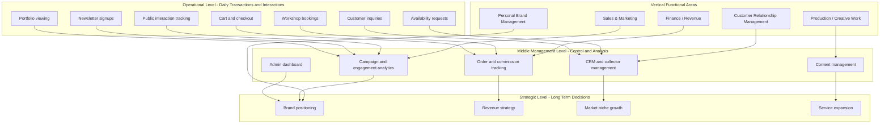
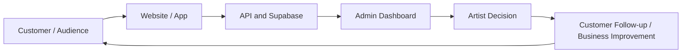
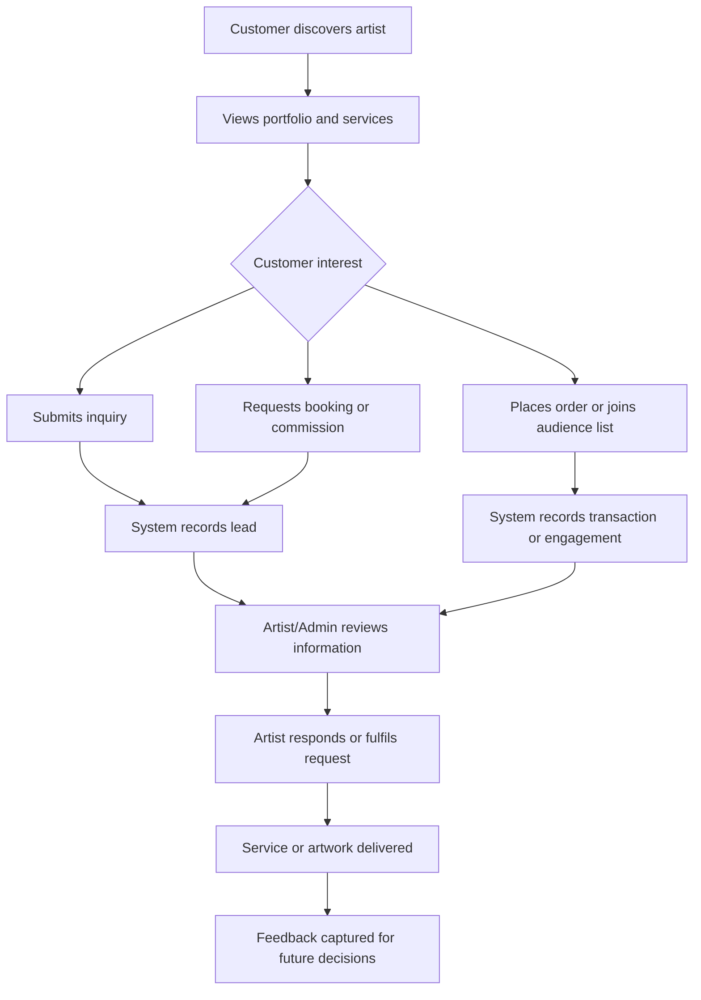
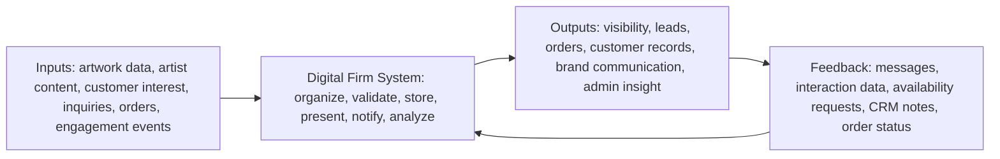
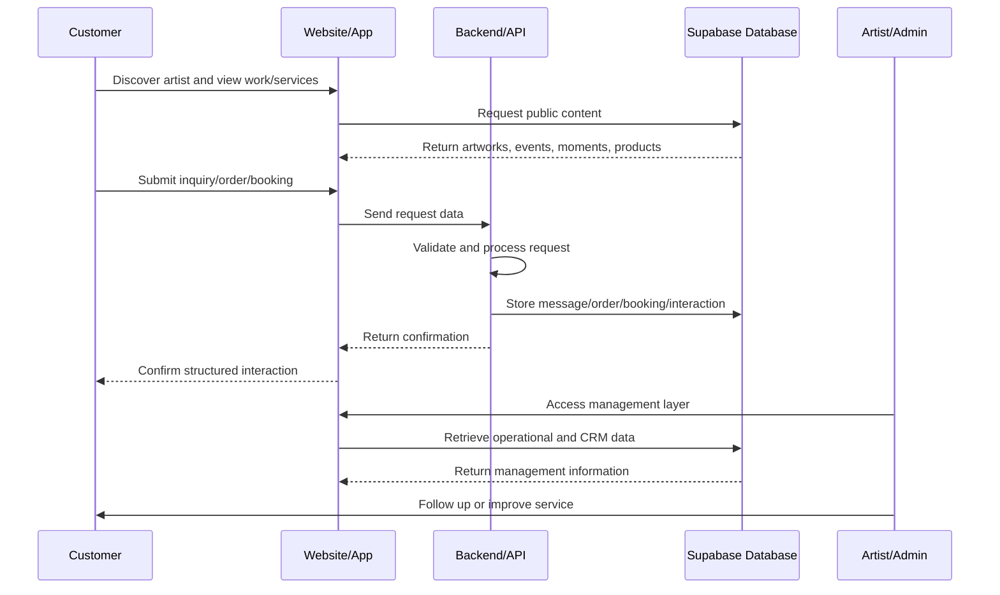
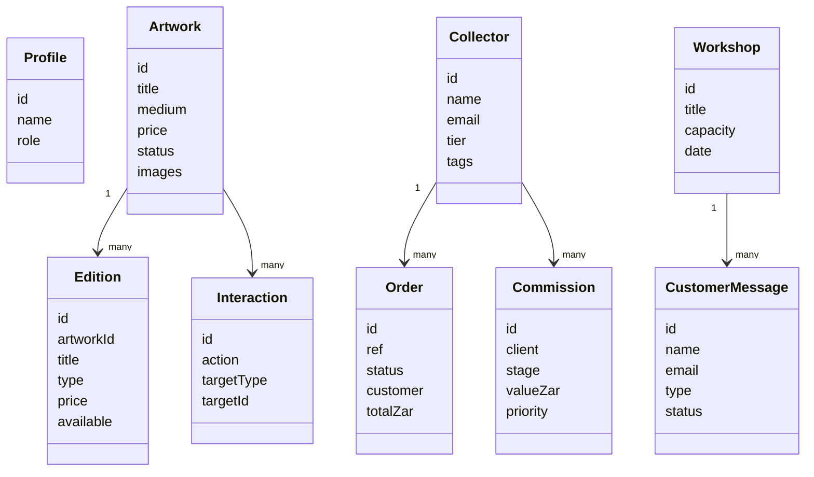

# Digital Firm MIS Analysis Report: Mapheane Digital Studio Platform

## Note to the Reviewer

This report is intended to explain the MIS substance behind the Digital Firm implementation. It is not a user manual; it analyzes how the system demonstrates digital firm concepts, business process transformation, information system value, and strategic business potential.

## 1. Executive Summary

Mapheane Digital Studio Platform is an applied Digital Firm case study built for a real local student artist. Before digitization, the artist's business activity would typically depend on informal visibility, social media exposure, physical networking, scattered messages, and word-of-mouth referrals. That model can create awareness, but it does not reliably structure customer interest, preserve business data, support management decisions, or scale revenue opportunities.

The platform changes this by converting an informal creative/person-brand into a structured digital business presence. It organizes portfolio visibility, service discovery, customer inquiries, commissions, events, orders, workshops, memberships, engagement signals, and administration into an integrated information system. The key contribution is therefore not the interface itself, but the way the system turns artistic activity into information flows, business processes, management records, and strategic insight.

From an MIS perspective, the project demonstrates Digital Firm theory, the Input-Process-Output-Feedback model, Laudon's Organization-Management-Technology model, Enterprise Application Architecture, customer relationship management, e-business/e-commerce potential, data-driven decision-making, and strategic business objectives of information systems. The business value created includes improved brand visibility, more professional customer interaction, structured lead capture, future sales potential, customer relationship development, and a foundation for evidence-based growth.

## 2. Academic Positioning of the Project

This project should not be assessed as merely a website or online portfolio. A portfolio presents work; this system goes further by embedding the artist's work inside digital business processes. It supports the movement from presentation to operation: customers can discover, inquire, buy, subscribe, request availability, join a collector circle, and interact with the artist's brand through structured digital channels.

Academically, the project is best understood as an applied MIS case study. It demonstrates how information systems can transform a real local student artist from an informal creative brand into a Digital Firm with identifiable processes, data flows, customer records, operational controls, and management insight.

The project is also significant because many Digital Firm assignments focus on large corporations that are already formally organized and already digital. This case shows that MIS concepts apply equally to small creative enterprises, student entrepreneurs, and local person-brands. In this context, the Digital Firm concept becomes practical and inclusive: it explains how even a one-person creative business can use information technology to structure operations, create value, build relationships, and compete more professionally.

## 3. From Informal Artist Brand to Digital Firm

Before digitization, a local emerging artist may depend on social media posts, exhibitions, casual conversations, direct messages, and personal networks. These channels are valuable, but they often leave important business activity unstructured. A potential collector might see an artwork but not know whether it is available. A commission request might be discussed but not tracked. A workshop inquiry might not become part of a customer database. Audience interest might exist but remain invisible to management decision-making.

After digitization, the artist gains a structured digital business presence. The platform organizes the portfolio, services, events, shop, commissions, customer communication, and admin functions into a coherent system. The MIS meaning is that business activity becomes recordable, analyzable, repeatable, and improvable.

This transformation matters because Digital Firms are defined by the use of information systems to support business processes and relationships, not by organizational size. Mapheane Digital Studio Platform shows that MIS can help a small creative business move from informal exposure to structured digital operations.

## 4. Business Model Analysis

Business Model = how the Digital Firm creates, delivers, and captures value.

| Business Model Element | MIS Analysis | Evidence in Codebase |
|---|---|---|
| Creative products and services | The artist creates value through original artworks, print editions, commissions, workshops, events, and membership experiences. MIS value comes from converting these offerings into identifiable business objects that can be promoted, tracked, and managed. | Gallery, artwork pages, shop, commission page, workshop page, events, collector circle |
| Portfolio visibility | The system delivers value by making the artist's work accessible beyond physical exhibitions and social media feeds. Visibility becomes a managed business asset rather than a temporary post. | Public portfolio pages, SEO files, image assets, press kit |
| Customer inquiries | The system turns informal customer communication into structured lead data that supports follow-up and conversion. | Contact API, messages table, commission creation logic |
| Brand identity | The artist's story, cultural context, and creative direction are treated as strategic assets that support differentiation. | About page, moments/journal, press kit, testimonials section |
| Audience engagement | Visitor actions become engagement signals that can inform marketing and relationship decisions. | `public_interactions`, newsletter subscribers, availability requests |
| Revenue potential | The system creates a foundation for direct sales, editions, commissions, workshops, memberships, and future digital products. | Orders, editions, memberships, workshops, commission pipeline |

The business value is that the artist is no longer limited to passive visibility. The platform creates an information-based business model where attention can become leads, leads can become relationships, and relationships can become revenue opportunities.

## 5. MIS Input-Process-Output-Feedback Analysis

| MIS Element | Implemented Analysis | Recommended Growth |
|---|---|---|
| Input | Artist content, artwork records, editions, event details, moments, workshop data, customer contact information, order details, payment proof uploads, newsletter signups, and interaction events enter the system as business data. | Add richer customer segmentation, referral source tracking, post-purchase feedback, and structured satisfaction data. |
| Process | The frontend organizes business information for customers; Supabase stores operational data; API routes validate and record transactions; admin modules transform records into management views. This processing converts raw activity into usable information. | Automate payment verification, booking scheduling, sales funnels, and campaign attribution. |
| Output | The system produces public visibility, service discovery, customer leads, order confirmations, CRM records, marketing lists, and management dashboards. These outputs make the artist more professional and easier to engage. | Add exportable management reports, customer account histories, and periodic analytics summaries. |
| Feedback | Implemented feedback includes messages, newsletter signups, public interaction tracking, availability requests, order statuses, and CRM notes. These feedback loops show customer interest and operational progress. | Add testimonials database, review forms, customer satisfaction surveys, and social media referral analytics. |

The MIS meaning is that the platform does not simply publish information. It creates a feedback loop in which customer behavior and business activity can influence future decisions about marketing, pricing, services, content, and growth.

## 6. Business Process Transformation

| Business Process | Before Digitization | After Digitization | MIS Value |
|---|---|---|---|
| Portfolio discovery | Customers rely on exhibitions, social media, or direct contact to see available work. | Artwork information is organized into a searchable and structured digital portfolio with status, imagery, and price context. | Reduces discovery friction and turns portfolio visibility into a managed business process. |
| Customer inquiry | Questions arrive through scattered informal channels and may be forgotten or difficult to classify. | Inquiry forms and API handling store messages and notify the artist. | Transforms informal communication into structured business data for tracking, follow-up, and conversion. |
| Service/commission request | Commission discussions may occur casually without workflow visibility or revenue planning. | Commission-related inquiries can become records in a commission pipeline. | Supports prioritization, progress tracking, client management, and future revenue forecasting. |
| Brand communication | The artist's story may be fragmented across posts, conversations, and physical events. | About, moments, press kit, events, and testimonials create a consistent brand narrative. | Strengthens differentiation, trust, and professional positioning. |
| Content/portfolio update | Updating business information can be inconsistent and dependent on manual edits. | Admin modules support structured management of artworks, events, shop items, moments, and settings. | Improves information quality, control, and business continuity. |
| Customer engagement | Audience behavior is difficult to measure and usually disappears after a visit or post. | Interactions, wishlists, newsletters, availability requests, and CRM records create engagement data. | Enables demand analysis and relationship management. |
| Booking/payment process | Bookings and payments may be arranged manually with limited traceability. | Orders, workshop bookings, payment proof upload, and order tracking are implemented, although full automated payment verification is still recommended. | Creates a foundation for e-commerce and operational accountability. |

The overall transformation is from informal creative work to measurable business processes. The platform makes artistic activity visible as data: inquiries become leads, orders become revenue records, interactions become demand signals, and customer relationships become manageable information assets.

## 7. Organization-Management-Technology Analysis

Laudon's Organization-Management-Technology model explains that information systems succeed when they align organizational needs, management decision-making, and technology infrastructure. The Mapheane Digital Studio Platform can be evaluated through all three dimensions.

### Organization

The organization is a small creative business centered on an individual artist. Its stakeholders include the artist/creator, potential collectors, artwork buyers, workshop participants, event audiences, press contacts, newsletter subscribers, and the wider creative community.

The organizational value is that the system gives structure to a business that might otherwise operate informally. It identifies products, services, customers, interactions, and administrative responsibilities. In MIS terms, it converts a person-brand into an organization with recognizable business processes.

### Management

Management in this system is not corporate management in the large-company sense; it is the artist's ability to make better decisions about a growing creative business. The platform supports decisions about which artworks to promote, which inquiries to follow up, which services to expand, how to manage commissions, how to communicate with collectors, and how to position the brand.

The admin dashboard is important because it turns operational records into management information. Messages, orders, commissions, CRM records, revenue analytics, engagement signals, campaign activity, and content readiness become evidence for decisions rather than scattered activity.

### Technology

The technology is relevant because it supports the organizational and management requirements above. The codebase uses React 18, TypeScript, Vite, Tailwind CSS, Framer Motion, Supabase Auth/Database/Storage, Vercel-style serverless API routes, Resend email integration, and deployment/security configuration in `vercel.json`.

| Technology Area | Evidence-Based MIS Relevance |
|---|---|
| Frontend | React pages and components present the artist's business offerings and create structured customer interaction points. |
| Backend/API | API routes handle contact, orders, newsletter, memberships, workshop bookings, interactions, tracking, campaigns, and settings, transforming user activity into business records. |
| Database | Supabase migrations define operational entities such as artworks, editions, orders, messages, commissions, collectors, events, workshops, memberships, interactions, newsletters, and availability requests. |
| Security/control | Supabase auth, admin roles, row level security, validation, CORS restrictions, rate limiting support, storage policies, and security headers support trust and control. |
| Deployment | Vercel configuration shows that the system is designed for web deployment rather than only local demonstration. |

The platform succeeds as an MIS project because it aligns the organization, management needs, and technology infrastructure. The technology is not decorative; it supports the artist's business structure and decision-making needs.

## 8. Enterprise Application Architecture Reflection

Enterprise Application Architecture explains how systems support different organizational levels and functional areas. Although this project serves a small Digital Firm, the same thinking applies because the system contains operational, middle-management, and strategic layers.

| Enterprise Level | Artist Digital Firm Application | MIS Meaning |
|---|---|---|
| Operational level | Customers view portfolio items, explore services, submit inquiries, join newsletters, place orders, book workshops, and request availability updates. | Daily interactions are captured as business activity. |
| Middle management level | The artist/admin monitors orders, messages, commissions, collectors, campaigns, engagement, revenue, and content readiness. | Operational data is organized into control and analysis information. |
| Strategic level | The artist evaluates brand positioning, revenue strategy, collector growth, market niche, and service expansion. | Management information supports long-term direction and competitive positioning. |

Functional areas represented:

| Functional Area | System Contribution | Business Value |
|---|---|---|
| Sales and marketing | Portfolio, shop, newsletter, campaigns, SEO, events, press kit | Increases reach and converts attention into leads. |
| Finance/revenue | Orders, editions, commissions, memberships, revenue analytics | Supports revenue tracking and future monetization. |
| Production/creative work | Artwork records, commissions, moments, gallery management | Connects creative production to market-facing information. |
| Customer relationship management | Collectors, messages, memberships, availability requests | Builds long-term relationships instead of one-time interactions. |
| Personal brand management | About, press kit, moments, testimonials, visual identity | Strengthens professional identity and differentiation. |

This shows that enterprise architecture thinking can be scaled down to a single creative entrepreneur. The value of EAA here is that it reveals how a small system can still integrate operational transactions, management control, and strategic insight.

## 9. Detailed Enterprise Application Architecture (EAA) of the Artist Digital Firm

Even though Mapheane Digital Studio Platform is a small Digital Firm, it can be analyzed using enterprise architecture thinking because it connects daily customer activity with management information and strategic decision-making. The diagram below shows how operational data flows upward into middle-level control and then into strategic insight, while functional areas support different parts of the business.

Operational systems capture daily interactions such as portfolio viewing, inquiries, checkout actions, bookings, and newsletter signups. Middle-level systems organize and analyze those interactions through dashboards, CRM, order tracking, campaign monitoring, and content management. Strategic-level decisions then use the information to improve brand direction, revenue strategy, market focus, and competitive positioning.

### Information Flow Across the Digital Firm

This is the MIS feedback loop. Customer behavior enters the system, the platform records and organizes it, the admin layer makes it visible, and the artist uses that information to improve communication, services, brand strategy, and future offerings.

## 10. Strategic Business Objectives of Information Systems

| Objective | Definition | Application to Mapheane Digital Studio Platform | Business Value |
|---|---|---|---|
| Operational excellence | Using information systems to improve efficiency, reliability, and quality of daily operations. | Inquiry capture, order handling, content management, admin dashboards, CRM records, and booking/order flows reduce dependence on informal manual work. | Fewer missed opportunities, faster follow-up, more consistent customer service, and better operational control. |
| New products, services, and business models | Using IS to create or support new offerings and revenue structures. | Editions, commissions, workshops, memberships, studio visits, online orders, and future digital products extend the artist beyond one-off physical sales. | Creates multiple revenue pathways and supports creative entrepreneurship. |
| Customer and supplier intimacy | Using IS to build closer, more responsive relationships with customers and partners. | Newsletter subscribers, collector CRM, messages, memberships, availability requests, and order tracking create direct relationship channels. | Builds trust, repeat interest, loyalty, and personalized follow-up. |
| Improved decision-making | Using timely and accurate information to guide business decisions. | Interaction data, order records, CRM notes, commission pipeline information, revenue analytics, and campaign data support evidence-based choices. | Helps the artist decide what to promote, which services to expand, and how to allocate limited creative time. |
| Competitive advantage | Using IS to differentiate the business or serve a market better than alternatives. | The platform gives a student artist a professional digital operating model that many informal competitors may not have. | Strengthens credibility, market reach, and collector confidence. |
| Survival | Using IS to remain relevant in a digital and competitive environment. | The system creates an online base for visibility, communication, selling, customer data, and brand growth. | Reduces dependence on physical networks and prepares the artist for digital market expectations. |

The six objectives show that the system is not simply decorative. It supports operational control, new business models, relationship building, decision-making, competitive positioning, and long-term relevance.

## 11. Competitive Advantage and Strategic Positioning

The platform supports three Porter-style MIS strategies:

| Strategy | Application | Strategic Meaning |
|---|---|---|
| Differentiation | The artist appears more professional, accessible, and credible through a coherent digital identity, structured portfolio, press presence, customer workflows, and order/inquiry channels. | The system helps the artist stand out by making the brand easier to understand, trust, and engage. |
| Focus strategy | The platform targets a niche audience interested in Mapheane's creative identity, local context, exhibitions, original works, editions, and workshops. | Rather than competing broadly, the artist can build a focused market around a distinctive creative position. |
| Customer intimacy | Direct contact forms, newsletters, memberships, collector CRM, availability requests, and follow-up records support closer relationships. | Customer interest becomes relationship capital instead of disappearing after a visit. |

Selecting a real local student artist is academically stronger than choosing a generic already-digital company because it shows MIS theory at the point of transformation. The project does not merely describe an organization that already has digital infrastructure; it demonstrates how information systems can create business structure where informality previously existed. This makes the case study more original, local, and analytically meaningful.

## 12. E-Business and E-Commerce Potential

The current system qualifies as e-business because it uses digital technology to support marketing, communication, customer relationship management, content management, brand visibility, orders, and administration. It also contains e-commerce functionality because cart, checkout, order creation, payment proof upload, order records, and order tracking are present.

However, the system is not yet fully automated e-commerce because payment confirmation appears to depend on manual proof review rather than an integrated mobile money or payment gateway. The MIS value of identifying this limitation is that it shows where the business can move from semi-digital transactions to fully integrated digital commerce.

| Future Addition | MIS Value |
|---|---|
| Automated online ordering | Reduces transaction friction and supports scalable sales. |
| Commission booking workflow | Converts custom artwork requests into a managed service pipeline. |
| Mobile money integration | Localizes payment technology for Lesotho and regional customers. |
| Rich artwork catalog | Supports inventory control, portfolio governance, and product discovery. |
| Digital product downloads | Creates scalable low-cost revenue opportunities. |
| Customer accounts | Builds repeat-purchase history and relationship continuity. |
| Automated order tracking | Improves transparency, trust, and service quality. |

## 13. Data, Databases, and Decision-Making

The codebase contains a Supabase-backed data model. This is important because a Digital Firm depends on the ability to capture, store, retrieve, and use information for business action.

| Implemented Entity | Decision-Making Value |
|---|---|
| `artworks` | Supports portfolio governance, availability decisions, pricing context, and creative inventory control. |
| `editions` | Supports scalable product sales and edition availability management. |
| `orders` | Supports revenue tracking, fulfilment decisions, payment follow-up, and customer service. |
| `messages` | Converts customer communication into structured leads for follow-up. |
| `commissions` | Supports pipeline visibility, project control, and potential revenue forecasting. |
| `collectors` | Enables CRM, segmentation, lifetime value tracking, and relationship notes. |
| `memberships` | Supports patronage, loyalty, and recurring relationship models. |
| `events` | Supports exhibition planning and audience engagement decisions. |
| `moments` | Supports brand storytelling and content strategy. |
| `workshops` and `workshop_bookings` | Supports service planning, capacity management, and demand assessment. |
| `newsletter_subscribers` | Supports marketing lists, audience segmentation, and campaign planning. |
| `public_interactions` | Supports behavioral analytics and demand signals. |
| `availability_requests` | Shows customer demand for specific artworks and supports follow-up. |
| `campaigns` and `campaign_recipients` | Supports targeted digital marketing and audience management. |

The MIS meaning of this data model is that business memory is no longer held only in the artist's mind, inbox, or social media accounts. It becomes a structured information asset that can support CRM, analytics, marketing, service planning, and growth decisions.

## 14. Security, Ethics, and Control

Security and ethics are central to MIS because customer trust is part of business value. A Digital Firm that collects names, emails, phone numbers, order details, payment proofs, and engagement data must protect that information responsibly.

| MIS Issue | Analysis | Business Value of Control |
|---|---|---|
| Privacy | Customer messages, orders, memberships, newsletter records, and bookings contain personal data. | Protects customer dignity, legal compliance, and trust. |
| Intellectual property | Artwork images and creative descriptions represent the artist's intangible assets. | Protects brand value and creative ownership. |
| Customer trust | Customers are more likely to inquire, buy, or subscribe when they believe the platform is responsibly managed. | Supports conversion and long-term reputation. |
| Access control | Admin modules expose sensitive business and customer records. | Prevents unauthorized access and protects operational integrity. |
| Form abuse and spam | Public forms can be exploited by bots or malicious users. | Reduces noise, protects workflow quality, and preserves service reliability. |
| Business continuity | Orders, customer records, and portfolio information are business assets that should not be lost. | Requires backup, recovery, and data governance planning. |
| Ethical data handling | Customer data should be collected for legitimate business purposes and not misused. | Builds responsible digital business practice. |

The codebase provides evidence of control through Supabase row level security, admin role checks, server-side validation, CORS restrictions, rate limiting support, storage policies, and deployment security headers. Future improvement should focus on audit logs, backup policy, privacy review, retention rules, and clearer consent management.

## 15. Decision Making and Analytics Potential

The platform has the foundation for management intelligence because customer activity can be captured and interpreted. This is important for a student artist because resources are limited; the artist needs evidence to decide where to invest effort.

| Decision Question | Relevant Data |
|---|---|
| Which artwork gets most attention? | Interaction events, artwork views, wishlist actions, availability requests. |
| Which services are requested most? | Message types, commission inquiries, workshop bookings, membership signups. |
| Which channels bring customers? | Newsletter source, campaign data, referral metadata, social tracking if expanded. |
| Which customer segments engage most? | Collector tags, memberships, newsletter segments, CRM notes, order history. |
| Should the artist introduce bookings, payments, or merchandise? | Inquiry volume, checkout activity, order data, availability requests, workshop demand. |

Recommended dashboards/KPIs:

| KPI | Management Purpose |
|---|---|
| Page views | Measures visibility and audience reach. |
| Inquiry count | Measures lead generation. |
| Most viewed artwork | Identifies market interest. |
| Conversion rate | Shows movement from attention to inquiry/order. |
| Repeat customer interest | Supports loyalty and CRM planning. |
| Social media referrals | Measures marketing effectiveness. |
| Commission pipeline value | Estimates potential future revenue. |
| Workshop booking demand | Supports service planning and scheduling. |

The business value of analytics is that creative decisions can be supported by evidence without removing artistic judgment. Data helps the artist understand audience behavior while preserving creative independence.

## 16. System Architecture as Evidence

The architecture is included only as evidence that the MIS concepts are implemented in a working system. It should not be read as a user guide.

| Architecture Area | Evidence and Analysis |
|---|---|
| Folder structure | `src/pages`, `src/components`, `src/components/admin`, `src/context`, `src/hooks`, `src/lib`, `api`, and `supabase/migrations` separate interface, business logic, API handling, and database schema. |
| Main public areas | Gallery, artwork, shop, commissions, workshops, events, moments, contact, checkout, tracking, press kit, and collector circle represent business functions. |
| Admin areas | Command center, CRM, orders, commissions, revenue, engagement, marketing, content management, settings, and readiness modules support management control. |
| Routing | A custom `PageName` union in `src/App.tsx` maps app state to URLs using the History API. It is functional, though a routing library may improve long-term maintainability. |
| Data flow | React hooks read Supabase records; contexts manage auth, cart, wishlist, currency, language, and notifications; APIs write operational records. |
| Backend/database | Serverless APIs and Supabase migrations show that the system stores and processes business records rather than only static content. |
| Deployment | `vercel.json` indicates deployment intent, SPA routing, region setting, and security headers. |

This architecture supports the report's central claim: the project is a practical Digital Firm prototype with public, operational, management, and data layers.

## 17. MIS Diagrams

Note: The Mermaid diagrams below should be exported as images for PDF submission if the PDF tool does not render Mermaid directly.

### 17.1 Business Process Activity Diagram

### 17.2 MIS Input-Process-Output Diagram

### 17.3 Sequence Diagram

### 17.4 Conceptual Class Diagram

The following diagram reflects implemented domain entities visible in the codebase and database migrations.

## 18. Implemented Strengths

| Group | Strength | MIS Value |
|---|---|---|
| Business value | The system supports multiple value channels: artworks, editions, commissions, workshops, memberships, events, and orders. | Demonstrates digital business model expansion beyond simple promotion. |
| Business value | Customer inquiries, availability requests, and orders are treated as business records. | Converts audience attention into actionable information. |
| MIS theory application | Input-process-output-feedback logic is visible in forms, APIs, database storage, and admin views. | Shows information systems theory in practice. |
| MIS theory application | OMT dimensions are present: a creative organization, management needs, and technology infrastructure. | Supports Laudon-style analysis. |
| Enterprise architecture | The system connects operational activity, management dashboards, and strategic possibilities. | Demonstrates scaled-down EAA for a small Digital Firm. |
| Software/architecture quality | React, TypeScript, Supabase, serverless APIs, RLS, and Vercel configuration form a coherent stack. | Provides credible evidence of implementation. |
| Local creative entrepreneurship impact | The system applies Digital Firm thinking to a real local student artist. | Makes MIS relevant to small businesses and creative economies. |

## 19. Limitations

| Limitation | Honest Assessment | MIS Growth Opportunity |
|---|---|---|
| Payment automation | Orders and payment proof upload exist, but full mobile money/payment gateway automation is not evident. | Integrate M-Pesa/EcoCash/Stripe-style confirmation or webhook verification. |
| Analytics depth | Interaction tracking and analytics modules exist, but deeper funnel analysis and attribution are future opportunities. | Add dashboards for conversion rates, sources, cohorts, and campaign performance. |
| Routing scalability | Custom routing works, but may become harder to maintain as the system grows. | Consider a routing library for long-term maintainability. |
| Data governance | A strong database exists, but formal backup, retention, and audit policies are not fully visible in code. | Add backup schedules, audit logs, and data retention rules. |
| Customer self-service | Order tracking exists, but full customer accounts/history are not clearly implemented. | Add account dashboards and repeat customer history. |
| PDF diagram rendering | Mermaid diagrams may not render automatically in all PDF workflows. | Export diagrams as images before final PDF submission. |

These limitations are not failures; they identify the next stage of MIS maturity. A Digital Firm prototype becomes stronger when its limitations are framed as future process, control, and decision-support improvements.

## 20. Recommendations

| Priority | Recommendation | MIS Reason |
|---|---|---|
| High | Strengthen inquiry management with statuses, response history, and conversion tracking. | Improves lead management and customer follow-up. |
| High | Continue strengthening admin content management for portfolio, shop, events, moments, and services. | Maintains accurate business information. |
| High | Expand analytics into a formal dashboard for traffic, inquiries, conversions, and artwork interest. | Improves evidence-based management. |
| High | Maintain and govern the database-backed portfolio with validation, backups, and media quality controls. | Protects information quality and business continuity. |
| Medium | Add a structured booking workflow with availability slots and reminders. | Supports workshops, studio visits, and commissions. |
| Medium | Add testimonials/reviews as database-backed feedback. | Builds trust and strengthens the feedback loop. |
| Medium | Improve SEO and social media integration with referral tracking. | Strengthens visibility and marketing measurement. |
| Future | Integrate automated e-commerce payments and mobile money verification. | Moves the system toward full e-commerce maturity. |
| Future | Add customer accounts and order/service history. | Strengthens customer intimacy and repeat engagement. |
| Future | Add AI-assisted recommendations or content insights. | Supports smarter promotion, segmentation, and content planning. |

## 21. Conclusion

The key contribution of Mapheane Digital Studio Platform is not the interface. Its contribution is that it demonstrates how an information system can structure and scale a real creative business process. The platform transforms informal artistic activity into a data-driven, process-oriented Digital Firm by organizing customer interest, portfolio information, sales potential, service requests, engagement data, and administrative control.

As an MIS case study, the project shows Digital Firm theory in a local creative economy context. It proves that information systems are not only for large corporations; they can also help student artists and small creative entrepreneurs become more visible, more organized, more responsive, and more strategically positioned.

The project demonstrates business process digitization, enterprise application architecture, customer relationship management, strategic objectives of information systems, competitive advantage, and future scalability. Its academic strength lies in connecting MIS theory to a real local business problem and showing how digital systems can convert a person-brand into a structured and growth-oriented Digital Firm.
