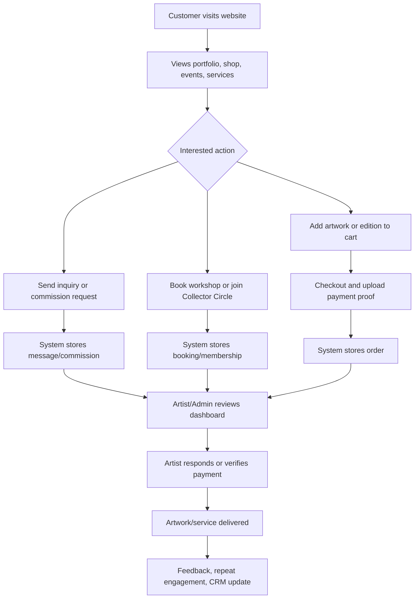
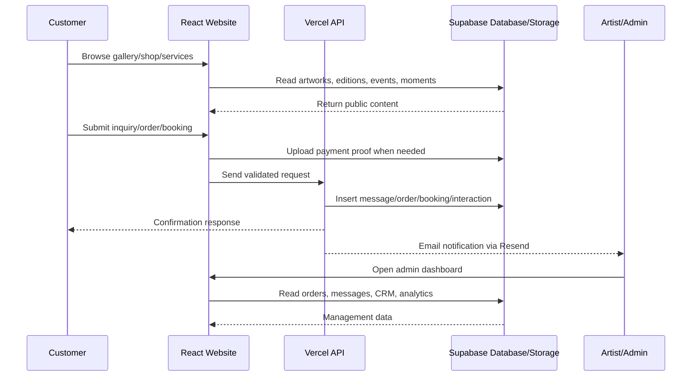
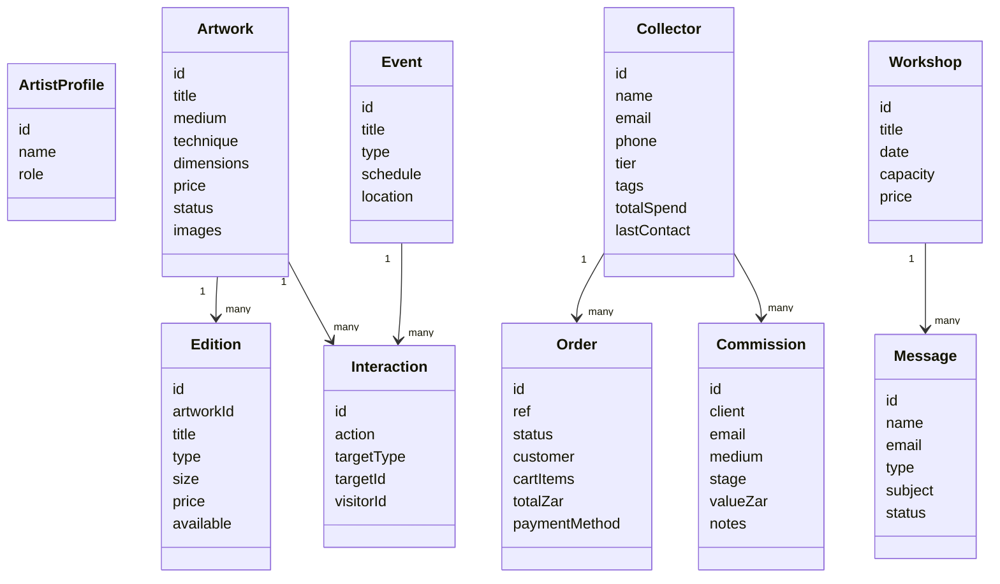
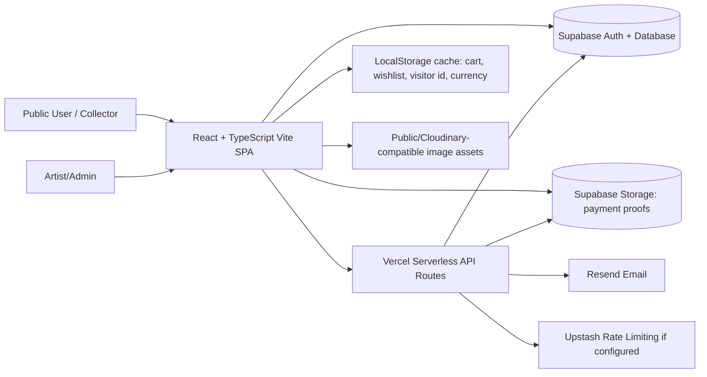

# Digital Firm Report: Mapheane Digital Studio Platform

## 1. Executive Summary

Mapheane Digital Studio Platform is a web-based Digital Firm system for Mapheane, a contemporary artist based in Maseru, Lesotho. It serves public visitors, collectors, workshop participants, commission clients, press contacts, and the artist/admin.

The system qualifies as a Digital Firm because it does more than display artwork. It digitizes core business functions: portfolio publishing, customer inquiries, e-commerce ordering, workshop booking, collector relationship management, commissions, marketing, analytics, and admin decision support. It creates business value by improving visibility, converting interest into leads and orders, organizing customer data, and giving the artist a structured platform for growth.

## 2. Background of the Digital Firm

The artist is treated as a business entity rather than only a creative individual. The system presents Mapheane's work, biography, events, editions, commissions, workshops, collector memberships, press kit, contact channels, and order tracking.

This project is meaningful because it applies MIS concepts to a real local student artist. Instead of choosing a large generic company, it shows that information systems can support micro-enterprises, creative entrepreneurship, person-brands, and informal local businesses that need digital structure to compete and grow.

## 3. Business Model of the Digital Firm

In MIS terms, a business model explains how a firm creates and captures value. This system supports value creation through:

| Value Area | Implemented Support | Business Value |
|---|---|---|
| Original artworks | Gallery, artwork detail pages, availability status, cart | Converts portfolio viewing into purchase interest |
| Print editions | Shop and edition management | Creates scalable revenue beyond one-off originals |
| Commissions | Commission page, inquiry handling, admin pipeline | Turns custom artwork requests into managed projects |
| Workshops | Workshop pages and booking API | Creates service-based income and community engagement |
| Events/exhibitions | Events pages, detail pages, calendar/RSVP interactions | Builds reputation and audience participation |
| Collector Circle | Membership signup and collector records | Supports loyalty, recurring relationships, patronage |
| Brand identity | About, press kit, moments/journal, SEO metadata | Builds credibility and cultural positioning |
| Digital marketing | Newsletter, campaigns, engagement tracking | Enables repeat communication and audience segmentation |

## 4. Value Chain Analysis

| Stage | Digital Firm Interpretation |
|---|---|
| Input | Artwork content, artist biography, events, prices, customer messages, orders, bookings, newsletter signups, engagement events |
| Processing | React interface organizes content; Supabase stores operational data; APIs validate requests, send emails, record orders and interactions |
| Output | Portfolio visibility, sales leads, confirmed orders, customer records, admin dashboards, marketing lists, order tracking |
| Feedback | Messages, newsletter signups, public interactions, availability requests, order status, CRM notes, analytics dashboards |

Primary activities include portfolio publishing, sales/order handling, commission management, workshop booking, marketing communication, and customer service. Support activities include admin settings, authentication, database management, image/storage handling, analytics, and security policies.

## 5. Key Business Processes Supported

| Process Name | Description | Actors | Input | Processing | Output | MIS Business Value |
|---|---|---|---|---|---|---|
| Portfolio Publishing | Artist publishes artworks and details | Artist/Admin, visitor | Artwork title, medium, price, images, status | Gallery/admin CRUD and Supabase artwork records | Public portfolio | Improves visibility and product discovery |
| Customer Inquiry | Visitors send messages | Customer, artist | Name, email, type, message | `/api/contact` validates, stores message, sends email | Inquiry record and notification | Converts interest into actionable leads |
| Commission Request | Client requests custom work | Client, artist | Budget, medium, message | Contact API also creates commission row for commission type | Commission pipeline entry | Structures custom work into a managed sales process |
| E-Commerce Order | Customer buys artwork/edition | Customer, artist/admin | Cart, contact, fulfilment, payment proof | Checkout uploads proof, `/api/orders` validates pricing and saves order | Pending order and email confirmation | Creates direct digital revenue channel |
| Workshop Booking | Customer requests workshop place | Customer, artist | Workshop, contact, message | `/api/workshop-bookings` validates and saves booking | Booking record and notification | Supports service revenue and audience development |
| Collector CRM | Admin manages collectors | Artist/Admin | Collector data, tags, lifetime value, notes | Admin CRM reads/updates Supabase collectors | Segmented customer database | Builds long-term customer relationships |
| Marketing Campaigns | Admin targets audiences | Artist/Admin | Campaign content, segment | Campaign API gathers recipients | Campaign queue/recipients | Enables structured digital marketing |
| Engagement Tracking | Site captures interactions | Visitor, system, admin | Views, shares, wishlist, RSVP, notify requests | `public_interactions` records behavioral events | Engagement dashboards | Supports evidence-based decisions |
| Admin Management | Artist controls operations | Artist/Admin | Orders, messages, artworks, events, settings | Admin dashboard modules | Operational control center | Centralizes management of the digital firm |

## 6. Information System Analysis

| IPOF Element | Analysis |
|---|---|
| Inputs | Artwork records, editions, orders, messages, commissions, customers, workshop bookings, event data, newsletter signups, public interactions |
| Processes | React state/context, Supabase queries, serverless API validation, email sending, storage upload, order normalization, admin dashboard calculations |
| Outputs | Public pages, carts, order confirmations, tracking timelines, admin KPIs, CRM records, campaign lists, gallery readiness scoring |
| Feedback | Messages, availability requests, engagement events, newsletter subscriptions, order statuses, CRM notes, analytics views |

Recommended feedback expansion: add formal customer reviews, post-purchase surveys, conversion funnels, and marketing-source attribution.

## 7. Organization-Management-Technology Model

### Organization

The organization is a small creative business/person-brand centered on one artist. Its customers include collectors, art buyers, workshop learners, event attendees, press contacts, and fans. The system supports the business processes of selling, marketing, publishing, relationship management, and service delivery.

### Management

The system supports decisions about artwork availability, pricing, customer follow-up, commission progress, workshop demand, revenue performance, collector segmentation, and brand readiness. The admin dashboard functions as a management cockpit for the artist.

### Technology

Implemented technology includes React 18, TypeScript, Vite, Tailwind CSS, Framer Motion, Lucide icons, Supabase Auth/Database/Storage, Vercel serverless API routes, Resend email integration, Upstash-compatible rate limiting, localStorage caching, SEO metadata, sitemap, robots file, and Vercel deployment configuration.

## 8. Enterprise Application Architecture Reflection

Although this is a small Digital Firm, it follows enterprise architecture thinking:

| Level | System Role |
|---|---|
| Operational | Visitors browse artworks, add to cart, send inquiries, book workshops, join membership, track orders |
| Middle Management | Admin tracks orders, messages, collectors, commissions, engagement, revenue, readiness |
| Strategic | Artist evaluates brand growth, market positioning, customer demand, revenue channels, and expansion opportunities |

Functional areas represented are Sales & Marketing, Finance/Revenue Potential, Production/Creative Work, Customer Relationship Management, Events/Workshops, and Personal Brand Management.

## 9. Strategic Objectives of Information Systems

| Objective | Applied Explanation |
|---|---|
| Operational excellence | Automates inquiry capture, order tracking, booking records, admin monitoring, and content management |
| New products, services, and business models | Adds editions, commissions, memberships, workshops, studio visits, and digital collector experiences |
| Customer and supplier intimacy | Stores customer records, messages, newsletter signups, collector profiles, and availability requests |
| Improved decision-making | Uses revenue analytics, engagement signals, order records, CRM data, and readiness scoring |
| Competitive advantage | Gives a local student artist a professional digital operating system usually associated with larger firms |
| Survival | Establishes online presence, digital sales capability, and customer data ownership in a digital economy |

## 10. Competitive Advantage and Uniqueness

The system is unique because it digitizes a real student artist and local creative brand. It converts informal artistic activity into structured digital business operations.

Using Porter's strategies:

| Porter Strategy | Application |
|---|---|
| Product differentiation | Artist identity, cultural story, portfolio presentation, press kit, collector experience |
| Focus strategy | Targets a niche market of local/international art collectors and creative audiences |
| Customer intimacy | CRM, newsletters, memberships, inquiries, availability requests, and personalized follow-up |

## 11. Collaboration, E-Business, and E-Commerce Potential

The system currently supports both e-business and e-commerce. E-business is visible through digital marketing, customer communication, admin workflows, CRM, content management, and analytics. E-commerce is implemented through cart, checkout, order submission, payment proof upload, order storage, and order tracking.

However, payments appear to be manual or semi-manual through methods such as M-Pesa/EcoCash/wire proof handling rather than automated gateway settlement. Recommended future features include payment gateway/webhook integration, booking calendar, downloadable digital products, automated invoices, customer accounts, and mobile money API integration.

## 12. Database and Information Management

A Supabase database exists. Implemented entities include:

| Entity/Table | Data Captured | Decision Value |
|---|---|---|
| `profiles` | User/admin identity and role | Access control and admin authorization |
| `artworks` | Artwork details, status, images, prices | Inventory and portfolio decisions |
| `editions` | Print editions, size, price, availability | Scalable product sales |
| `orders` | Customer, cart, fulfilment, payment proof, status | Revenue and fulfilment tracking |
| `messages` | Contact inquiries and metadata | Lead management |
| `commissions` | Client, medium, stage, value, notes | Pipeline and project tracking |
| `collectors` | CRM profile, tags, spend, preferences | Relationship management |
| `memberships` | Collector Circle tiers and billing status | Patronage/revenue planning |
| `events` | Exhibitions/events schedule and details | Audience engagement |
| `moments` | Journal/content posts | Brand storytelling |
| `workshops` | Workshop details and capacity | Service planning |
| `workshop_bookings` | Participant inquiries | Attendance and demand tracking |
| `newsletter_subscribers` | Email, source, segments | Marketing segmentation |
| `public_interactions` | Views, shares, wishlist, RSVP, notify events | Behavioral analytics |
| `availability_requests` | Artwork interest/waitlist requests | Demand forecasting |
| `campaigns`, `campaign_recipients` | Marketing campaigns and targets | Campaign execution |

This is a meaningful information asset, not merely website content.

## 13. Security, Ethics, and Control

Implemented controls include Supabase Row Level Security, admin role checks, protected admin dashboard, server-side validation in APIs, CORS restrictions, rate limiting support, honeypot fields, proof upload validation, security headers in `vercel.json`, and restricted payment-proof viewing policies.

Ethical and control issues include protecting customer contact details, safeguarding payment proof files, respecting artwork copyright, avoiding unauthorized image reuse, controlling admin access, backing up database records, and ensuring consent-based newsletters. Recommended improvements include audit logs, stronger Content Security Policy without inline script/style where practical, formal privacy compliance review, and automated backup procedures.

## 14. Decision Making and Analytics

The system can support decisions such as:

| Decision Question | Implemented/Available Data |
|---|---|
| Which artworks attract attention? | `public_interactions` by target artwork |
| Which services are requested? | `messages`, `commissions`, `workshop_bookings` |
| Which customer segments engage most? | `collectors`, `newsletter_subscribers`, tags, source fields |
| Which revenue streams perform best? | `orders`, `commissions`, editions, memberships |
| Which marketing channels work? | Newsletter source, campaign recipients, interaction metadata |

Recommended additions: conversion funnel dashboard, artwork-level view-to-inquiry ratio, acquisition source tracking, cohort analysis, and exportable lecturer/business reports.

## 15. System Architecture Review

Reviewed repository evidence includes `package.json`, `src/App.tsx`, `src/pages/AdminDashboard.tsx`, `api/orders.js`, `api/contact.js`, and `supabase/migrations/20260325000000_initial_schema.sql`.

| Area | Finding |
|---|---|
| Framework | React 18 + TypeScript + Vite SPA |
| Routing | Custom `PageName` union and History API, not React Router |
| State | Context providers for auth, cart, wishlist, currency, language, toasts |
| Backend | Vercel-style serverless functions in `api/` |
| Database | Supabase schema migrations with RLS policies |
| Storage | Supabase `payment-proofs` storage bucket/policies |
| Admin | Dashboard modules for command center, revenue, engagement, CRM, commissions, gallery, shop, orders, messages, marketing, settings |
| Styling | Tailwind CSS with custom design system |
| SEO | Metadata, sitemap, robots, JSON-LD hook |
| Strengths | Clear domain coverage, real data model, admin workflows, local payment context, MIS-aligned analytics |
| Weaknesses | Large production JS bundle warning, custom routing may become hard to maintain, some static fallback artwork data still exists, manual payment verification, no automated payment webhook |

Build verification: `npm run build` completed successfully. Vite warned that the main JavaScript chunk is larger than 500 kB, so code-splitting is recommended.

## 16. Diagrams

### 16.1 Activity Diagram

### 16.2 Sequence Diagram

### 16.3 Class Diagram

### 16.4 System Architecture Diagram

## 17. Strengths of the System

| Perspective | Strengths |
|---|---|
| MIS | Digitizes business processes, captures data, supports decision-making, includes CRM and analytics |
| Software | Strong React structure, Supabase schema, API validation, admin dashboard, security controls, successful production build |
| Business/Creative | Turns an artist brand into a structured digital business with sales, services, memberships, marketing, and audience growth |

## 18. Limitations

The system still has realistic limitations. Payment handling is not fully automated through a live mobile money/payment gateway. The JavaScript bundle is large and would benefit from code-splitting. Custom routing may become less maintainable as the platform grows. Analytics are useful but could become more formal with dashboards for conversion rates and marketing attribution. Some static/fallback artwork data still exists in the repository, so live data governance should be maintained carefully.

## 19. Recommendations

Recommended improvements:

| Recommendation | Purpose |
|---|---|
| Add automated M-Pesa/EcoCash/payment gateway confirmation | Reduce manual verification work |
| Add code-splitting and lazy-loaded admin/public routes | Improve performance |
| Add inquiry-to-sale conversion dashboard | Strengthen management decision-making |
| Add customer testimonials/reviews database | Improve trust and feedback |
| Add booking calendar with availability slots | Improve workshop and studio visit scheduling |
| Add audit logs for admin actions | Improve control and accountability |
| Add automated backups and export tools | Protect business information |
| Add richer SEO/social analytics | Improve digital marketing effectiveness |
| Add customer account/order history | Improve customer intimacy |
| Add product/image governance workflow | Protect artwork quality and copyright |

## 20. Conclusion

Mapheane Digital Studio Platform is a strong Digital Firm project because it demonstrates that MIS is not limited to large corporations. It applies Laudon & Laudon concepts to a real local student artist and shows how information systems can digitize business processes, customer relationships, marketing, sales, decision-making, and brand growth.

The system is persuasive as an MIS submission because it treats the artist as a serious creative enterprise. It transforms a personal art practice into a data-supported digital business with public engagement, operational workflows, admin control, and strategic growth potential.
